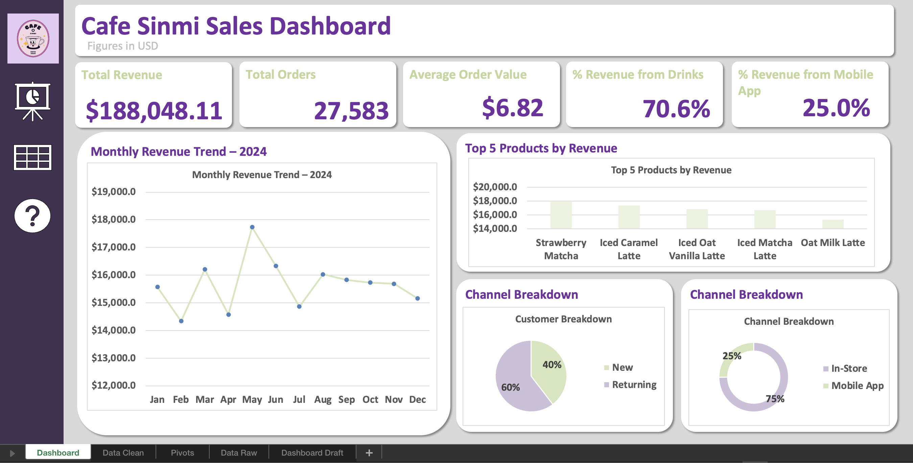

# Coffee Shop Sales Dashboard (Excel)

I built a decision-ready Excel dashboard from **27,000+ sales records** to track performance, uncover revenue drivers, and support smarter business decisions (product strategy, channel growth, and retention).

 **Tools:** Excel · PivotTables · PivotCharts · Data Cleaning · KPI Design · Segmentation
 
---

## Dashboard Preview

**[Download the Excel dashboard](https://github.com/SinmiAriyibi/coffee-shop-sales-dashboard-excel/blob/b0f9e41e9469ac60914c29b43626f6ef33cba54b/Sinmi-Coffee-Shop-Sales_2025!.xlsx)**

---
---

## What I Built!
An Excel dashboard that answers:
- What’s driving revenue month-to-month?
- Which products contribute the most to sales?
- Are repeat customers carrying the business?
- How strong is mobile/app ordering vs in-store?

---

## What I Did (The Work Behind the Dashboard)
- Cleaned and standardized a raw dataset (**27k+ rows**) for analysis readiness  
- Built PivotTables + PivotCharts to automate KPI reporting  
- Created calculated metrics (AOV, channel contribution, customer mix)  
- Designed a clean dashboard layout for quick stakeholder read-through

---

## Insights That Matter
- **In-store sales dominate (~75%)** → strongest short-term revenue lever
- **Returning customers drive ~60% of revenue** → retention is the growth engine
- Best-selling items skew heavily toward **specialty iced drinks** → strong opportunity for seasonal promos + inventory optimization

---

## Why This Matters (The Business Value)
This dashboard can be used to:
- Prioritize high-performing products for promotions
- Improve staffing/inventory planning around peak demand
- Track customer retention vs acquisition performance
- Measure and grow the mobile ordering channel

---
